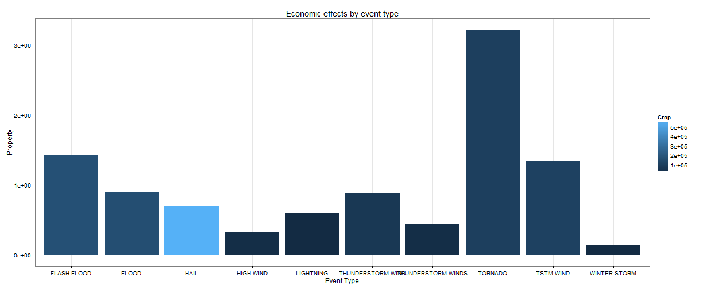

Exploring the NOAA Storm Database to uncover the events with biggest effect on Population Health and the Economy
=======================

Synopsis
---------------------------
describes and summarizes the data analysis in less than 10 sentences

The purpose of this report is to use the information stored in the  NOAA Storm Database to find out which types of events have the most severe effects on Population Health and the Economy. This is **important**, because if we are able to **stratify** these events with respect to the aforementioned categories, given the fact that there are **finite resources that can be dedicated for prevention and protection against these events**, we can focus these resources to target the events with the biggest impact, thus **maximizing the efficiency of those resources**.

We will start with an exploration of the data, in an attempt to find out what sort of information is included, which are the variables in the dataset we need to focus on, whether we need to clean or impute the data and in general any assumptions we need to have in mind for our analysis.

The questions we are looking to answer do not require statistical inference. As a starting point, descriptive statistics should provide us with enough understanding to answer. However, it might be meaningfull to retrospectively look for other underlying relations in our data.

After loading and processing the dataset, we will do any necessary transformations 
Data Processing
---------------
describes how the data were loaded into R and processed for analysis


```r
setwd("D:\\Coursera\\Reproducible Research\\RepData_PeerAssessment2")
library(knitr)
library(ggplot2)
library(dplyr)
```

```
## Warning: package 'dplyr' was built under R version 3.0.3
```

```
## 
## Attaching package: 'dplyr'
## 
## The following objects are masked from 'package:stats':
## 
##     filter, lag
## 
## The following objects are masked from 'package:base':
## 
##     intersect, setdiff, setequal, union
```


```r
data <- read.csv("data/repdata-data-StormData.csv.bz2")
data <- tbl_df(data)
str(data)
```

```
## Classes 'tbl_df', 'tbl' and 'data.frame':	902297 obs. of  37 variables:
##  $ STATE__   : num  1 1 1 1 1 1 1 1 1 1 ...
##  $ BGN_DATE  : Factor w/ 16335 levels "1/1/1966 0:00:00",..: 6523 6523 4242 11116 2224 2224 2260 383 3980 3980 ...
##  $ BGN_TIME  : Factor w/ 3608 levels "00:00:00 AM",..: 272 287 2705 1683 2584 3186 242 1683 3186 3186 ...
##  $ TIME_ZONE : Factor w/ 22 levels "ADT","AKS","AST",..: 7 7 7 7 7 7 7 7 7 7 ...
##  $ COUNTY    : num  97 3 57 89 43 77 9 123 125 57 ...
##  $ COUNTYNAME: Factor w/ 29601 levels "","5NM E OF MACKINAC BRIDGE TO PRESQUE ISLE LT MI",..: 13513 1873 4598 10592 4372 10094 1973 23873 24418 4598 ...
##  $ STATE     : Factor w/ 72 levels "AK","AL","AM",..: 2 2 2 2 2 2 2 2 2 2 ...
##  $ EVTYPE    : Factor w/ 985 levels "   HIGH SURF ADVISORY",..: 834 834 834 834 834 834 834 834 834 834 ...
##  $ BGN_RANGE : num  0 0 0 0 0 0 0 0 0 0 ...
##  $ BGN_AZI   : Factor w/ 35 levels "","  N"," NW",..: 1 1 1 1 1 1 1 1 1 1 ...
##  $ BGN_LOCATI: Factor w/ 54429 levels "","- 1 N Albion",..: 1 1 1 1 1 1 1 1 1 1 ...
##  $ END_DATE  : Factor w/ 6663 levels "","1/1/1993 0:00:00",..: 1 1 1 1 1 1 1 1 1 1 ...
##  $ END_TIME  : Factor w/ 3647 levels ""," 0900CST",..: 1 1 1 1 1 1 1 1 1 1 ...
##  $ COUNTY_END: num  0 0 0 0 0 0 0 0 0 0 ...
##  $ COUNTYENDN: logi  NA NA NA NA NA NA ...
##  $ END_RANGE : num  0 0 0 0 0 0 0 0 0 0 ...
##  $ END_AZI   : Factor w/ 24 levels "","E","ENE","ESE",..: 1 1 1 1 1 1 1 1 1 1 ...
##  $ END_LOCATI: Factor w/ 34506 levels "","- .5 NNW",..: 1 1 1 1 1 1 1 1 1 1 ...
##  $ LENGTH    : num  14 2 0.1 0 0 1.5 1.5 0 3.3 2.3 ...
##  $ WIDTH     : num  100 150 123 100 150 177 33 33 100 100 ...
##  $ F         : int  3 2 2 2 2 2 2 1 3 3 ...
##  $ MAG       : num  0 0 0 0 0 0 0 0 0 0 ...
##  $ FATALITIES: num  0 0 0 0 0 0 0 0 1 0 ...
##  $ INJURIES  : num  15 0 2 2 2 6 1 0 14 0 ...
##  $ PROPDMG   : num  25 2.5 25 2.5 2.5 2.5 2.5 2.5 25 25 ...
##  $ PROPDMGEXP: Factor w/ 19 levels "","-","?","+",..: 17 17 17 17 17 17 17 17 17 17 ...
##  $ CROPDMG   : num  0 0 0 0 0 0 0 0 0 0 ...
##  $ CROPDMGEXP: Factor w/ 9 levels "","?","0","2",..: 1 1 1 1 1 1 1 1 1 1 ...
##  $ WFO       : Factor w/ 542 levels ""," CI","$AC",..: 1 1 1 1 1 1 1 1 1 1 ...
##  $ STATEOFFIC: Factor w/ 250 levels "","ALABAMA, Central",..: 1 1 1 1 1 1 1 1 1 1 ...
##  $ ZONENAMES : Factor w/ 25112 levels "","                                                                                                                               "| __truncated__,..: 1 1 1 1 1 1 1 1 1 1 ...
##  $ LATITUDE  : num  3040 3042 3340 3458 3412 ...
##  $ LONGITUDE : num  8812 8755 8742 8626 8642 ...
##  $ LATITUDE_E: num  3051 0 0 0 0 ...
##  $ LONGITUDE_: num  8806 0 0 0 0 ...
##  $ REMARKS   : Factor w/ 436781 levels "","-2 at Deer Park\n",..: 1 1 1 1 1 1 1 1 1 1 ...
##  $ REFNUM    : num  1 2 3 4 5 6 7 8 9 10 ...
```


The data consist of 902297 of 37 variables. After consulting the [Storm Data documentation](https://d396qusza40orc.cloudfront.net/repdata%2Fpeer2_doc%2Fpd01016005curr.pdf "Storm Data documentation") and the [FAQ](https://d396qusza40orc.cloudfront.net/repdata%2Fpeer2_doc%2FNCDC%20Storm%20Events-FAQ%20Page.pdf "FAQ") documents we decided to focus on a specific subset of variables namely:
FATALITIES, INJURIES, PROPDMG, and CROPDMG . We will create a subset dataset called df that only contains these variables. 


```r
df <- select(data, EVTYPE, FATALITIES, INJURIES, PROPDMG, CROPDMG)
```

We then proceed to aggregate by event type.

```r
df_by_event <- group_by(df, EVTYPE)
```


Results
=======
the main results are presented

Types of events that are most harmful with respect to population health
------------------------------------------------------------------------
Here we can see the Fatalities and Injuries by event, ordered by most Fatalities and then by most Injuries (top ten).

```r
pop_health <- summarise(df_by_event, Fatalities = sum(FATALITIES), Injuries = sum(INJURIES)) %.% 
    arrange(desc(Fatalities), desc(Injuries))
(pop_health <- pop_health[1:10, ])
```

```
## Source: local data frame [10 x 3]
## 
##            EVTYPE Fatalities Injuries
## 1         TORNADO       5633    91346
## 2  EXCESSIVE HEAT       1903     6525
## 3     FLASH FLOOD        978     1777
## 4            HEAT        937     2100
## 5       LIGHTNING        816     5230
## 6       TSTM WIND        504     6957
## 7           FLOOD        470     6789
## 8     RIP CURRENT        368      232
## 9       HIGH WIND        248     1137
## 10      AVALANCHE        224      170
```


```r
g1 <- ggplot(pop_health, aes(x = EVTYPE, y = Fatalities, fill = Injuries)) + 
    geom_bar(stat = "identity")
g1 + theme_bw() + ggtitle("Fatalities and injuriesby event type")
```

 


Types of events with the greatest economic consequences
-------------------------------------------------------
Here we present the Economic effects ordered by Property damage and then by Crop damage (top ten)

```r
economy <- summarise(df_by_event, Property = sum(PROPDMG), Crop = sum(CROPDMG)) %.% 
    arrange(desc(Property), desc(Crop))
(economy <- economy[1:10, ])
```

```
## Source: local data frame [10 x 3]
## 
##                EVTYPE Property   Crop
## 1             TORNADO  3212258 100019
## 2         FLASH FLOOD  1420125 179200
## 3           TSTM WIND  1335966 109203
## 4               FLOOD   899938 168038
## 5   THUNDERSTORM WIND   876844  66791
## 6                HAIL   688693 579596
## 7           LIGHTNING   603352   3581
## 8  THUNDERSTORM WINDS   446293  18685
## 9           HIGH WIND   324732  17283
## 10       WINTER STORM   132721   1979
```


```r
g2 <- ggplot(economy, aes(x = EVTYPE, y = Property, fill = Crop)) + geom_bar(stat = "identity")
g2 + theme_bw() + ggtitle("Economic effects by event type")
```

 


Conclusions
===========
